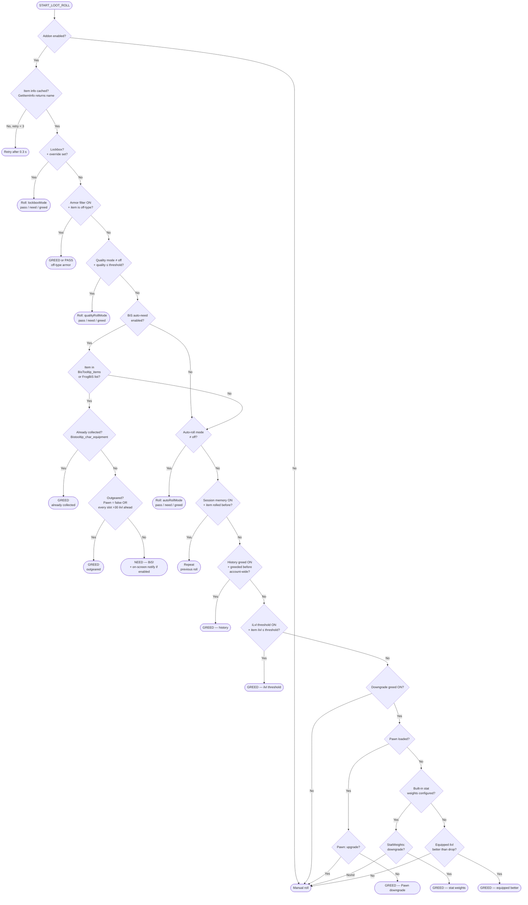

# aSmoothLootHelper — Options UI Redesign Proposal

## Problem with the current UI

The current panel requires users to configure 15+ individual settings before the addon does anything useful in a raid. A new user has to:

1. Enable the master toggle
2. Enable armor type filter + pick pass/greed
3. Enable BiS auto-need
4. Enable downgrade greed
5. Optionally import stat weights
6. Figure out what "auto-roll mode" even is and when to switch it

Most of that configuration is the same for every raiding character in MoP. Only the **BiS provider** and **what to do with off-type loot** really differ between players.

---

## Design Goals

- **30-second setup**: a new user can have the addon working sensibly in a single step (pick a Mode).
- **Minimap icon** for one-click access to the most common mid-session switches (on/off, mode swap).
- **Armor type is always on in MoP** — it's a core specialisation mechanic (+5 % primary stat). There is no reason to have it behind an "enable" checkbox.
- **Advanced settings exist but are not required** — power users can still fine-tune everything.

---

## Proposed Layout

```
┌─────────────────────────────────────────────────────────────┐
│  aSmoothLootHelper                           [?] Help        │
├─────────────────────────────────────────────────────────────┤
│  [✓] Enable aSmoothLootHelper                               │
│  [✓] Show minimap icon                                       │
│                                                             │
│  ── PLAY MODE ─────────────────────────────────────────     │
│                                                             │
│  Mode  [ Raiding (smart) ▼ ]                                │
│        · Raiding (smart)    — armor filter on, BiS need,    │
│                               downgrade greed               │
│        · Farming / Solo     — greed everything, skip trash  │
│        · Carry / Boost      — pass everything               │
│        · Custom             — use advanced settings below   │
│                                                             │
│  ── ARMOR TYPE ─────────────────────────────────────────    │
│                                                             │
│  Detected: Plate  (Paladin)                                 │
│  Off-type armor action  [ Pass ▼ ]  (Greed | Pass)          │
│                                                             │
│  In MoP, wearing your main armor type grants a +5%          │
│  primary stat bonus. Off-type items are handled             │
│  automatically — no separate enable needed.                 │
│                                                             │
│  ── BIS AUTO-NEED ───────────────────────────────────────   │
│                                                             │
│  [✓] Auto-need BiS items                                    │
│      All loaded providers are queried; first match wins.    │
│      Active:  [✓] BisTooltip (Wowhead)                     │
│               [✓] FrogBiS                                   │
│               [ ] AtlasLoot wishlist  (not installed)       │
│      No provider detected — install BisTooltip or FrogBiS.  │
│  [✓] Include off-spec                                        │
│  [✓] On-screen notification on BiS need                      │
│                                                             │
│  ▼ ADVANCED SETTINGS ───────────────────────────────────── │
│   (collapsed by default)                                    │
│                                                             │
│    Session memory         [✓]                               │
│    History auto-greed     [✓]                               │
│    Downgrade greed        [✓]  (Pawn → stat weights → ilvl) │
│    Stat weights  Source:  [ Pawn scales ▼ / Import string ] │
│      Main spec:  [ Balance Druid (Pawn) ▼ ]                 │
│      Offspec:    [ Restoration Druid (Pawn) ▼ ]             │
│      [Import main]  [Import offspec]  [Clear all]           │
│    iLvl threshold greed   [ ] ── 0 ──────── 600  [ 0  ↵]   │
│                                              type directly ↑│
│    Quality auto-roll      Off ▼  on  Uncommon or lower ▼   │
│    Lockboxes              Pass ▼                            │
│    Debug mode             [ ]                               │
│    [Show Debug Log]                                         │
└─────────────────────────────────────────────────────────────┘
```

---

## Mode Presets — What Each One Sets

| Setting                   | Raiding (smart) | Farming / Solo    | Carry / Boost | Custom   |
|---------------------------|-----------------|-------------------|---------------|----------|
| Armor type filter         | **ON** (always) | OFF               | OFF           | as-is    |
| Off-type action           | Pass (default)  | —                 | —             | as-is    |
| BiS auto-need             | ON (if provider)| OFF               | OFF           | as-is    |
| Downgrade auto-greed      | ON              | OFF (greed all)   | OFF           | as-is    |
| Quality threshold greed   | OFF             | Rare or lower     | OFF           | as-is    |
| Auto-roll override        | off             | greed             | pass          | as-is    |
| Session memory            | ON              | ON                | OFF           | as-is    |
| History auto-greed        | ON              | ON                | OFF           | as-is    |

> Switching mode **writes** all the relevant per-character settings listed above.  
> Switching to **Custom** just stops the mode preset from overwriting anything — existing values are preserved.

---

## Minimap Icon

Right-click menu on the minimap icon:

```
  aSmoothLootHelper
  ────────────────────────────────
  [✓] Enabled                       ← master toggle
  ────────────────────────────────
  Mode:
      (•) Raiding (smart)
      ( ) Farming / Solo
      ( ) Carry / Boost
      ( ) Custom
  ────────────────────────────────
  [✓] BiS auto-need                 ← per-character toggle
  ────────────────────────────────
      Open full options…
      Show debug log…
```

Left-click: toggles the addon on/off (same as `/slh on` / `/slh off`).

---

## Slash Command Updates

Extend `/slh mode` to accept the new mode names alongside the legacy ones:

| Command                    | Effect                                      |
|----------------------------|---------------------------------------------|
| `/slh`                     | Open options panel                          |
| `/slh on` / `/slh off`     | Master enable/disable                       |
| `/slh mode raid`           | Switch to Raiding preset                    |
| `/slh mode farm`           | Switch to Farming / Solo preset             |
| `/slh mode carry`          | Switch to Carry / Boost preset              |
| `/slh mode custom`         | Switch to Custom (no preset applied)        |
| `/slh mode pass`           | Legacy: auto-roll override = pass (kept)    |
| `/slh mode greed`          | Legacy: auto-roll override = greed (kept)   |
| `/slh mode need`           | Legacy: auto-roll override = need (kept)    |

---

## New SavedVariable Fields

Two new fields needed in `CHAR_DEFAULTS`:

```lua
playMode = "raiding",   -- "raiding" | "farming" | "carry" | "custom"
minimapEnabled = true,  -- show/hide minimap icon
```

The existing `autoRollMode` field stays but is now **written by the mode preset** rather than set directly by the user in the main UI (it is still visible/editable under Advanced > Custom).

---

## What Changes vs. What Stays

| Old setting                                 | New location / treatment                                  |
|---------------------------------------------|-----------------------------------------------------------|
| Enable aSmoothLootHelper (account)          | Top of panel — unchanged                                  |
| Armor filter enable checkbox (per char)     | **Removed** — always on in Raiding mode, always off in Farming/Carry; controlled by mode |
| Armor filter action (greed/pass)            | Stays, moved up to the Armor Type section                 |
| Auto-roll mode dropdown                     | **Replaced** by Mode preset; raw value under Advanced     |
| Session memory checkbox                     | Moved to Advanced (default stays true in Raiding)         |
| History auto-greed checkbox                 | Moved to Advanced (default stays true)                    |
| Downgrade greed checkbox                    | Moved to Advanced                                         |
| Stat weights import/export (single)         | Moved to Advanced; expanded to per-spec profiles (see Multi-Spec Stat Weights section) |
| iLvl threshold greed                        | Moved to Advanced                                         |
| Quality auto-roll (mode + threshold)        | Moved to Advanced (auto-set to "Rare or lower / greed" in Farming mode) |
| BiS auto-need + offspec + notification      | Stays in main panel — these are the settings users actually tweak |
| Lockboxes                                   | Moved to Advanced                                         |
| Debug mode + debug log button               | Moved to Advanced                                         |

---

## Multi-Spec Stat Weights (Future)

Currently a single Pawn string can be imported per character. Once offspec BiS rolling
is used in practice, comparing upgrades accurately requires a weights profile per spec.

### Two sources, one UI

```
┌── Stat Weights ─────────────────────────────────────────────────────┐
│  Source  ( ) Pawn addon  (•) Import strings                         │
│                                                                     │
│  ── When source = Pawn addon ─────────────────────────────────────  │
│  Reads the list of scales stored in the Pawn addon SavedVariables.  │
│  Pawn is detected as an OptionalDep — if absent, source falls back. │
│                                                                     │
│   Main spec scale:   [ Balance Druid (imported) ▼ ]                 │
│   Offspec scale:     [ None ▼ ]                                     │
│                                                                     │
│  ── When source = Import strings ────────────────────────────────── │
│  Paste one Pawn string per spec slot.                               │
│                                                                     │
│   Main spec:   [ ("( Pawn: v1" ...scale string...) ]  [Import] [✓]  │
│   Offspec:     [                                    ]  [Import]      │
│                [Clear all]  [Export main]  [Export offspec]          │
└─────────────────────────────────────────────────────────────────────┘
```

### How the downgrade check uses profiles

| Situation                            | Profile used                              |
|--------------------------------------|-------------------------------------------|
| Item is BiS for main spec            | Main spec profile                         |
| Item is BiS for offspec only         | Offspec profile (if configured)           |
| No BiS match, normal downgrade check | Main spec profile                         |
| Profile not configured               | Falls back to ilvl comparison (as today)  |

### Pawn integration detail

Pawn exposes its stored scales via `PawnGetAllScales()` → returns a table of scale
names. `PawnGetScaleValue(scaleName, itemLink)` returns the score. We can enumerate
these at panel-open time and populate the dropdown without parsing anything.

If the player uses Pawn, selecting their Pawn scale from the dropdown is the zero-effort
path — no import string needed. If Pawn is absent, import strings work as today.

### New SavedVariable fields needed

```lua
statWeightProfiles = {           -- replaces statWeights + statWeightsName
    main   = { name = "Balance Druid", weights = { ... } },
    offspec = { name = "Resto Druid",  weights = { ... } },
},
statWeightSource = "pawn",       -- "pawn" | "import"
statWeightPawnMain   = "Balance Druid",   -- Pawn scale name for main
statWeightPawnOffspec = nil,              -- Pawn scale name for offspec
```

The old `statWeights` / `statWeightsName` fields are migrated into
`statWeightProfiles.main` on first load for backward compat.

---

## Current Loot Decision Flowchart



### Decision priority (top = highest)

| Priority | Rule                              | Outcome          | Notes                                         |
|----------|-----------------------------------|------------------|-----------------------------------------------|
| 1        | Addon disabled                    | Skip (no roll)   |                                               |
| 2        | Lockbox override                  | pass/need/greed  | Bypasses everything else                      |
| 3        | Armor type filter                 | GREED or PASS    | Off-type armour, ignores weapons/rings/etc.   |
| 4        | Quality threshold                 | pass/need/greed  | e.g. auto-greed all greens                    |
| 5a       | BiS — not collected, not outgeared| **NEED**         | Requires BisTooltip or FrogBiS                |
| 5b       | BiS — already collected/outgeared | GREED            |                                               |
| 6        | Auto-roll override                | pass/need/greed  | Session-scoped; resets on logout              |
| 7        | Session memory                    | repeat last roll | Per-character, clears on logout               |
| 8        | History auto-greed                | GREED            | Account-wide greed history                    |
| 9        | iLvl threshold                    | GREED            | "Greed anything below X ilvl"                 |
| 10a      | Downgrade — Pawn                  | GREED            | Most accurate; requires Pawn addon            |
| 10b      | Downgrade — built-in stat weights | GREED            | Fallback if Pawn absent                       |
| 10c      | Downgrade — equipped ilvl         | GREED            | Last-resort fallback                          |
| 11       | No rule matched                   | Manual roll      |                                               |

---

## Implementation Notes

- The **Mode preset** logic can live in a new `Options:ApplyMode(modeName)` function that writes all the relevant `charDB` keys in one call. Called both from the dropdown's `OnChange` and from `/slh mode <name>`.
- The **minimap icon** should use `LibDBIcon-1.0` (already bundled inside BisTooltip — do not bundle a second copy; vendor-copy or declare as OptionalDep).
- The **Advanced section** can be a simple show/hide toggle on a sub-frame; no need for a tab system.
- `armorFilterEnabled` can be **deprecated** and replaced by the mode preset writing it directly. Legacy saves with `armorFilterEnabled = true/false` should be honoured on first load and then migrated.
- Armour type auto-detection already works (`ItemUtil:GetPlayerArmorType()`); display it as a read-only label so users can confirm the addon knows their class.
- **BiS providers are additive** — all registered providers are queried on every roll; the first to return `true` wins. The provider status list in the UI reflects every provider that has called `RegisterBiSProvider` (i.e. its addon loaded). Providers that aren't installed show as greyed-out. A future **AtlasLoot wishlist** provider can be added by registering against the same API (`SLH:RegisterBiSProvider("AtlasLoot", provider)`) with no changes to `RollManager` or the options panel — it will appear in the active-providers list automatically.

---

## Future Provider & IsCollected Enhancements

### Bank scanning

Currently `IsCollected()` in both BisTooltipProvider and FrogBiSProvider only checks
equipped slots and bags 0–4. Items sitting in the bank are invisible to the check,
causing unnecessary auto-needs on items the player already owns but stored away.

**How to fix**: Listen for `BANKFRAME_OPENED`, scan bag slots `-1` (main bank) and
`5`–`5 + NUM_BANKBAGSLOTS - 1` (bank bag rows), and persist the result in
`aSmoothLootHelperCharDB.bankCache = { [itemID] = true, ... }`. Refresh the cache on
every `BANKFRAME_OPENED`. Both providers' `IsCollected()` methods (and any future
providers) can then check this shared cache in addition to the live bag/equip scan.

```lua
-- Pseudocode — lives in aSmoothLootHelper.lua or a new Core/BankScanner.lua
local frame = CreateFrame("Frame")
frame:RegisterEvent("BANKFRAME_OPENED")
frame:SetScript("OnEvent", function()
    local cache = {}
    local getSlots = C_Container and C_Container.GetContainerNumSlots or GetContainerNumSlots
    local getItem  = C_Container and C_Container.GetContainerItemID  or GetContainerItemID
    -- Main bank bag (-1) + bank bag slots (5 .. 5+NUM_BANKBAGSLOTS-1)
    local bags = { -1 }
    for b = 5, 4 + (NUM_BANKBAGSLOTS or 7) do bags[#bags+1] = b end
    for _, bag in ipairs(bags) do
        for slot = 1, (getSlots(bag) or 0) do
            local id = getItem(bag, slot)
            if id then cache[id] = true end
        end
    end
    aSmoothLootHelperCharDB.bankCache = cache
end)
```

Providers check `aSmoothLootHelperCharDB.bankCache[itemID]` as a third source
alongside bags and equipped gear.

---

### Tier token auto-need

Tier tokens (e.g. "Helm of the Cursed Protector", ilvl 528, `type=Miscellaneous /
subType=Junk`) are now detectable via `ItemUtil:IsTierToken(itemLink)` and
`ItemUtil:IsTierTokenForPlayer(itemLink)` (already implemented in `Core/ItemUtil.lua`).

Token type → class mapping for all MoP tiers (T14 / T15 / T16):

| Token type  | Classes                                  |
|-------------|------------------------------------------|
| Protector   | Warrior, Hunter, Shaman, **Monk**        |
| Conqueror   | Paladin, Priest, Warlock                 |
| Vanquisher  | Death Knight, Druid, Mage, Rogue         |

A future rule in `RollManager:EvaluateRoll` (between the quality threshold check and
the BiS check) could auto-need tokens for the player's class and auto-pass/greed the
rest. This would be toggled by a new `charDB.tierTokenNeedEnabled` setting.

---

### Transmog wishlist provider (community contribution)

`C_TransmogCollection.PlayerHasTransmog(itemID)` **is available in MoP Classic**
(confirmed via AppearanceTooltip addon which uses it as its fallback for all classic
builds). `C_TransmogCollection.PlayerHasTransmogByItemInfo(link)` may not be present,
but the itemID overload is sufficient for our use-case.

This means a transmog provider can auto-detect collected appearances **without any
wishlist** — it can call `C_TransmogCollection.PlayerHasTransmog(itemID)` in
`IsCollected()` to skip auto-needing appearances the player already owns, and
`IsBiS()` could check a manually maintained wishlist for items the player still wants.

Suggested approach for a community-contributed provider:

- Player marks items they want for transmog via a `/slh wishlist add` command or an
  in-game tooltip button ("Add to transmog wishlist").
- Items are stored in `aSmoothLootHelperCharDB.transmogWishlist = { [itemID] = true }`.
- A `TransmogWishlistProvider` implements the standard three-method interface:
  - `IsBiS(itemID)` → `charDB.transmogWishlist[itemID] == true`
  - `IsCollected(itemID)` → bag/equipped/bank check (shared utility)
  - `IsNormalVersionOfBiS(itemID)` → same as `IsBiS`
- Registers via `SLH:RegisterBiSProvider("TransmogWishlist", provider)`.
- No changes to `RollManager` needed; it appears in the active-providers list
  automatically and is labelled "Transmog wishlist" in the UI.

This design intentionally keeps the provider self-contained so community members can
ship it as a standalone addon that calls `SLH:RegisterBiSProvider` on load.
